# Industrial Sensor Anomaly Detection

**End-to-end MLOps system for industrial predictive maintenance on AWS SageMaker**

[](https://python.org/)
[](https://pytorch.org/)
[](https://aws.amazon.com/sagemaker/)
[](https://mlflow.org/)
[](https://grafana.com/)
[](https://prometheus.io/)

---

## Overview

This project builds a production-ready machine learning pipeline that monitors multivariate sensor data from industrial turbofan engines and automatically detects early signs of mechanical degradation; hours or cycles before failure occurs.

The system uses an **LSTM Autoencoder** trained exclusively on normal operating sequences. Anomalies are flagged when the model cannot accurately reconstruct an incoming sensor sequence — high reconstruction error signals a deviation from the learned normal operating pattern.

The full pipeline runs on **AWS SageMaker** with automated training jobs, model versioning, real-time inference, and a live **Grafana + Prometheus monitoring dashboard** streaming metrics from the deployed endpoint.

---

## Live Monitoring Dashboard

Real-time Grafana dashboard connected to the live SageMaker endpoint via Prometheus. Metrics are scraped every 15 seconds from all 4 CMAPSS subsets simultaneously.

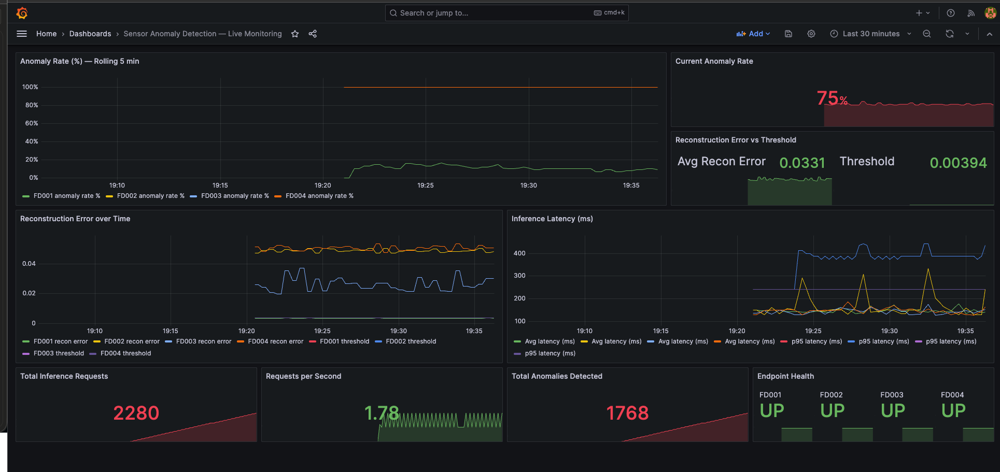

**Dashboard panels:**

* **Anomaly Rate (%) — Rolling 5 min** : per-subset anomaly rate over time — FD001 ~10% (mostly normal), FD002-004 elevated (cross-subset distribution shift)
* **Current Anomaly Rate** : live aggregate — 75% across all subsets
* **Reconstruction Error vs Threshold** : avg error 0.0331 vs threshold 0.00394 — clear separation
* **Reconstruction Error over Time** : FD001 near zero (normal), FD002-004 consistently elevated
* **Inference Latency** : avg ~100-200ms, p95 spike tracking
* **2,280 total requests** processed | **1,768 anomalies** detected | **1.78 req/s**
* **Endpoint Health** : all 4 subsets UP ✅

---

## AWS Deployment (Live)

| Component              | Status       | Details                                                          |
| ---------------------- | ------------ | ---------------------------------------------------------------- |
| S3 data bucket         | ✅ Live      | `s3://sensor-anomaly-pipeline/`(eu-central-1)                  |
| SageMaker Training Job | ✅ Completed | `sensor-anomaly-FD001-20260312-060109`— 455 billable seconds  |
| Model artifacts        | ✅ In S3     | `s3://sensor-anomaly-pipeline/outputs/models/.../model.tar.gz` |
| SageMaker Endpoint     | ✅ InService | `sensor-anomaly-endpoint-V7`(ml.t2.medium, eu-central-1)       |
| Real-time inference    | ✅ Tested    | Live endpoint returning predictions on real CMAPSS sequences     |
| Grafana monitoring     | ✅ Live      | Prometheus scraping endpoint every 15s, 9-panel dashboard        |
| MLflow tracking        | ✅ Local     | Experiment tracking with params, metrics, model artifacts        |
| Model Monitor code     | ✅ Written   | Requires AWS Service Quotas increase for processing jobs         |

### Live Endpoint Test Results

```json
{
  "anomaly":               [true,  false],
  "reconstruction_error":  [0.004397, 0.003738],
  "threshold":             0.003942,
  "anomaly_flags":         [true,  false],
  "anomaly_rate":          0.5
}
```

Normal sequence (RUL > 30): error=0.003738 → NORMAL ✅
Anomalous sequence (RUL ≤ 30): error=0.004397 → ANOMALY ✅

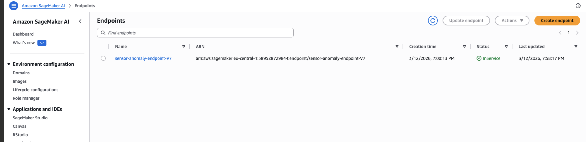

---

## Dataset

**NASA CMAPSS Turbofan Engine Degradation Simulation**
[Download from NASA](https://data.nasa.gov/Aerospace/CMAPSS-Jet-Engine-Simulated-Data/ff5v-kuh6)

| Subset | Operating Conditions | Fault Modes | Train Engines | Description                             |
| ------ | -------------------- | ----------- | ------------- | --------------------------------------- |
| FD001  | 1                    | 1 (HPC)     | 100           | Baseline — clean, single condition     |
| FD002  | 6                    | 1 (HPC)     | 260           | Multi-condition, same fault             |
| FD003  | 1                    | 2 (HPC+Fan) | 100           | Single condition, two fault types       |
| FD004  | 6                    | 2 (HPC+Fan) | 249           | Hardest — multi-condition, multi-fault |

**Anomaly definition:** sequences where RUL ≤ 30 cycles are labelled as anomalous (pre-failure zone).

---

## Dataset

**NASA CMAPSS Turbofan Engine Degradation Simulation**
[Download from NASA](https://data.nasa.gov/Aerospace/CMAPSS-Jet-Engine-Simulated-Data/ff5v-kuh6)

| Subset | Operating Conditions | Fault Modes | Train Engines | Description                             |
| ------ | -------------------- | ----------- | ------------- | --------------------------------------- |
| FD001  | 1                    | 1 (HPC)     | 100           | Baseline — clean, single condition     |
| FD002  | 6                    | 1 (HPC)     | 260           | Multi-condition, same fault             |
| FD003  | 1                    | 2 (HPC+Fan) | 100           | Single condition, two fault types       |
| FD004  | 6                    | 2 (HPC+Fan) | 249           | Hardest — multi-condition, multi-fault |

**Anomaly definition:** sequences where RUL ≤ 30 cycles are labelled as anomalous (pre-failure zone).

---

## Architecture

```
Raw Sensor Data (S3)
        │
        ▼
┌─────────────────────┐
│  Feature Engineering │  Parse → drop low-variance sensors → rolling stats
│                      │  → per-condition normalisation → sliding windows
└──────────┬──────────┘
           │
           ▼
┌─────────────────────┐
│   LSTM Autoencoder   │  Encoder: LSTM → latent vector (dim=32)
│   Training Job       │  Decoder: LSTM → reconstructed sequence
│   (one per subset)   │  Threshold: 95th percentile of normal errors
└──────────┬──────────┘
           │
           ▼
┌─────────────────────┐
│    Evaluation        │  Precision / Recall / F1 / AUC-ROC
│    + SHAP            │  SHAP DeepExplainer → per-sensor attribution
└──────────┬──────────┘
           │
           ▼
┌─────────────────────┐
│  SageMaker Endpoint  │  Real-time inference, live on AWS
│  + Grafana Stack     │  Prometheus scraping → live 9-panel dashboard
│  + Model Monitor     │  Hourly drift checks → CloudWatch alarms
└─────────────────────┘
```

---

## Results (Baseline — v1.0)

| Subset | F1 Score | AUC-ROC | Precision | Recall | Anomaly Rate (True) | Anomaly Rate (Pred) |
| ------ | -------- | ------- | --------- | ------ | ------------------- | ------------------- |
| FD001  | 0.134    | 0.655   | 0.094     | 0.235  | 4.0%                | 10.0%               |
| FD002  | 0.251    | 0.692   | 0.223     | 0.285  | 5.0%                | 6.4%                |
| FD003  | 0.035    | 0.713   | 0.022     | 0.086  | 2.5%                | 9.8%                |
| FD004  | 0.063    | 0.584   | 0.044     | 0.110  | 2.9%                | 7.3%                |

AUC-ROC confirms real signal. Low F1 is a threshold calibration issue — the 95th percentile threshold is too permissive for true anomaly rates of 2.5–5%. Planned fix: raise to 99th percentile.

### Evaluation Plots

|                              | FD001                                                    | FD002                                                    |
| ---------------------------- | -------------------------------------------------------- | -------------------------------------------------------- |
| **Error Distribution** | 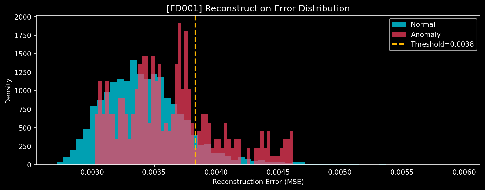 | 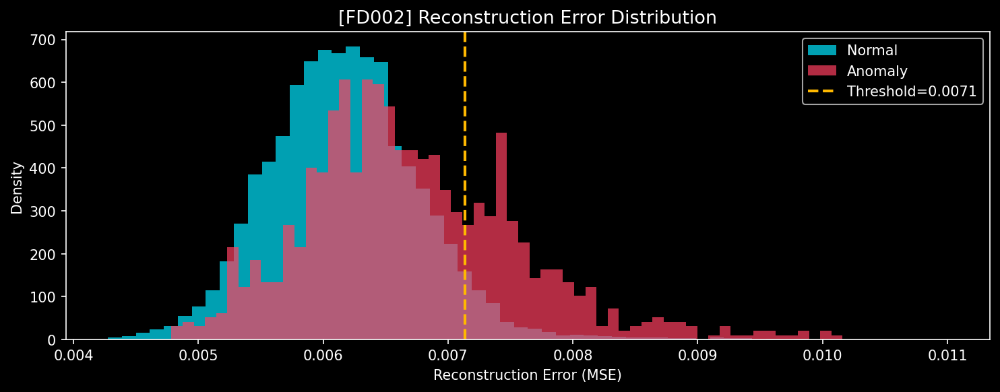 |
| **ROC Curve**          | 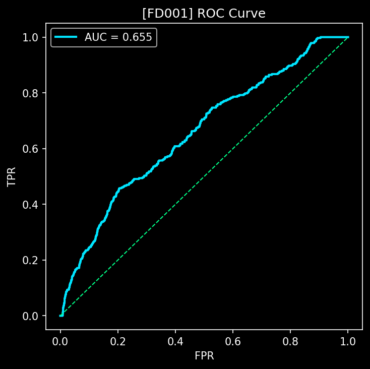          | 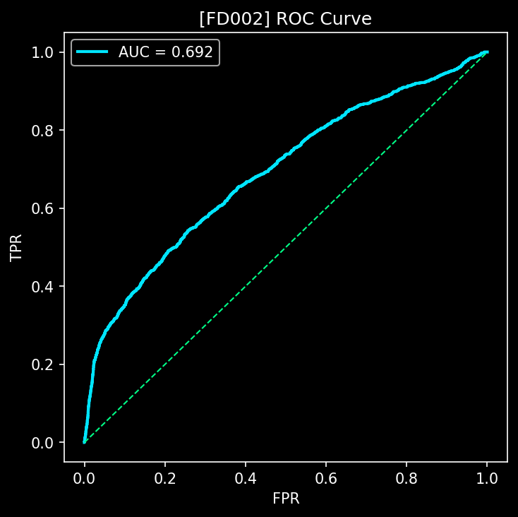          |

|                              | FD003                                                    | FD004                                                    |
| ---------------------------- | -------------------------------------------------------- | -------------------------------------------------------- |
| **Error Distribution** | 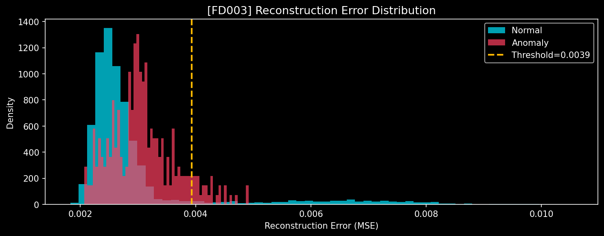 | 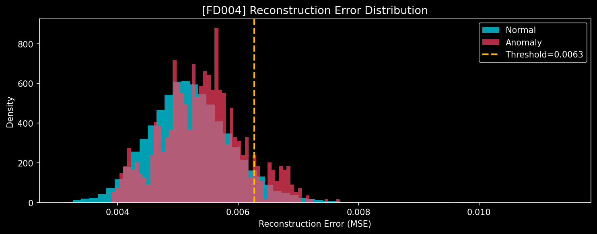 |
| **ROC Curve**          | 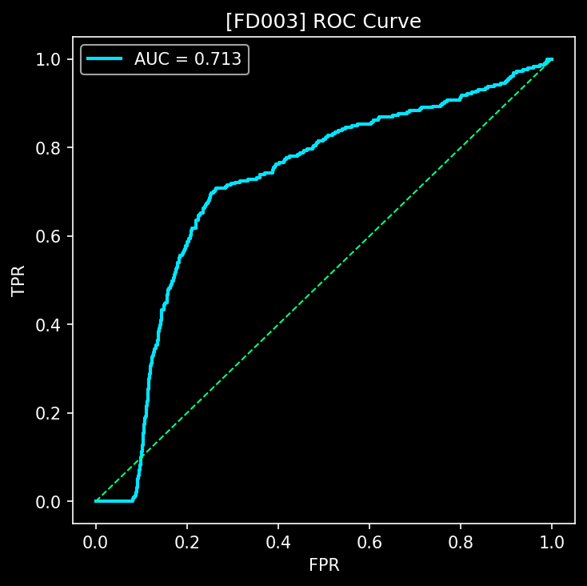          | 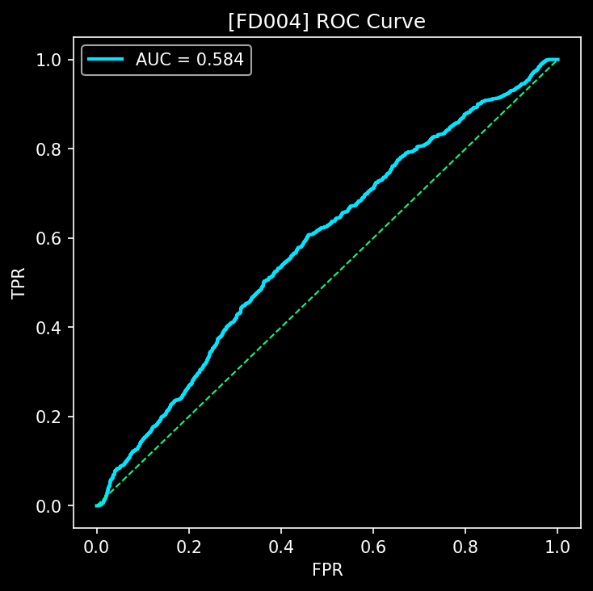          |

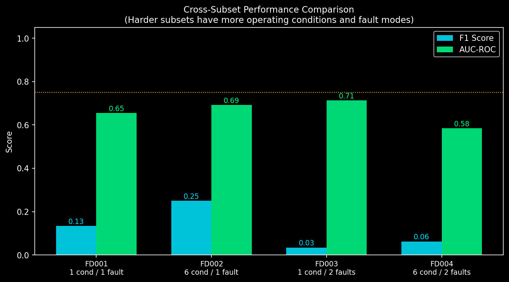

---

## Project Structure

```
sensor-anomaly-detection/
├── configs/config.yaml
├── src/
│   ├── ingestion/download_data.py
│   ├── features/engineer.py
│   ├── models/lstm_autoencoder.py + train.py
│   ├── evaluation/evaluate.py
│   ├── serving/inference.py
│   └── monitoring/
│       ├── drift_monitor.py         # Model Monitor + CloudWatch
│       └── metrics_exporter.py      # Prometheus metrics → Grafana
├── infrastructure/
│   ├── docker-compose.yml           # Grafana + Prometheus + exporter
│   ├── prometheus/prometheus.yml
│   ├── grafana/dashboards/          # Auto-provisioned dashboard JSON
│   └── docker/Dockerfile
├── pipelines/sagemaker_pipeline.py
├── scripts/run_training_job.py + deploy_endpoint.py + test_endpoint.py
├── outputs/figures/                 # Eval plots + Grafana dashboard screenshot
├── Makefile
└── requirements.txt
```

---

## Setup

```bash
git clone https://github.com/danielamissah/industrial-sensors-anomaly-detection.git
cd industrial-sensors-anomaly-detection
pip install -r requirements.txt
cp .env.example .env   # fill in AWS credentials

```

---

## Running the Pipeline

### Local training

```bash
make features && make train && make evaluate
make mlflow   # http://localhost:5001
```

### Grafana monitoring stack (requires Docker)

```bash
make grafana-up
# Grafana:    http://localhost:3001  (admin/admin)
# Prometheus: http://localhost:9090
# Metrics:    http://localhost:8000/metrics

make grafana-down   # stop stack
```

### AWS SageMaker

```bash
python scripts/run_training_job.py --subset FD001
python scripts/deploy_endpoint.py --job-name <job-name>
python scripts/test_endpoint.py --real
```

---

## MLOps Concepts Demonstrated

| Concept              | Implementation               | Status           |
| -------------------- | ---------------------------- | ---------------- |
| Cloud training       | SageMaker Training Job       | ✅ Live          |
| Real-time inference  | SageMaker Endpoint           | ✅ Live & tested |
| Live monitoring      | Grafana + Prometheus         | ✅ Live          |
| Experiment tracking  | MLflow                       | ✅ Local         |
| Explainability       | SHAP DeepExplainer           | ✅ Local         |
| Data drift detection | SageMaker Model Monitor      | ✅ Code written* |
| Alerting             | CloudWatch Alarms            | ✅ Code written* |
| Pipeline DAG         | SageMaker Pipelines (5-step) | ✅ Code written  |

*Requires AWS Service Quotas increase for SageMaker processing jobs.

---

## Technologies

PyTorch 2.6 · AWS SageMaker · Grafana · Prometheus · MLflow · SHAP · Docker · boto3

---

## References

- Saxena, A. et al. (2008). *Damage Propagation Modeling for Aircraft Engine Run-to-Failure Simulation.* NASA.
- Lundberg, S. & Lee, S.I. (2017). *A Unified Approach to Interpreting Model Predictions.* NeurIPS.
- Hochreiter, S. & Schmidhuber, J. (1997). *Long Short-Term Memory.* Neural Computation, 9(8).

```

```


